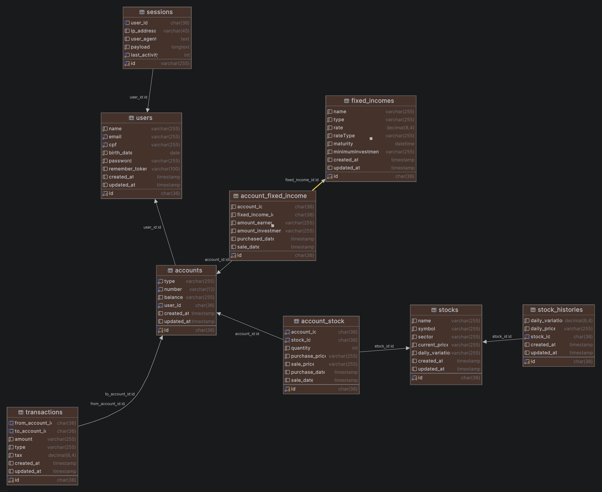

# OrangeJuiceBank - Hackathon de Investimentos

Boas vindas ao desafio do Orange Hackathon!  
**API de um mini banco de investimentos**, simulando operações comuns do mercado financeiro.

## Objetivo
Uma **API RESTful** que simula as operações de uma plataforma de investimentos digital, além de uma interface **frontend** (web ou mobile) para interação com a API. O objetivo é representar o fluxo real de um banco de investimentos, incluindo movimentações financeiras, aplicações em diferentes tipos de ativos e a visualização dessas operações pelo usuário. O frontend deve permitir que os usuários consultem saldos, realizem operações financeiras e acompanhem seus investimentos de forma intuitiva, proporcionando uma experiência próxima à de uma plataforma real de investimentos.

## Funcionalidades

- Acessar contas de usuário
- Realizar **depósitos**, **saques** e **transferências** entre contas
- Investir em ativos:
  - Ações
  - Renda fixa:
    - CDB
    - Tesouro Direto
- Realizar **compra e venda de ativos**
- Cálculo automático de taxas e tributos por operação(caso aplicável a operação)

## Instalação e Execução
### Pré-requisitos
- Node.js (versão 20 ou superior)
- npm (gerenciador de pacotes do Node.js)
- Banco de dados (MySQL)
- Git (para clonar o repositório)
- PHP (versão 8.2 ou superior)
- Composer (gerenciador de dependências do PHP)

### Passos para Instalação
1. Instale as dependências:
   ```bash
   npm install
   composer install
   ```
2. Configure as variáveis de ambiente:
   - Copie o arquivo `.env.example` para `.env`.
    - Ajuste as configurações do banco de dados conforme necessário.
3. Execute as migrações para criar as tabelas necessárias:
   ```bash
   php artisan migrate --seed
   ```
4. Inicie o servidor de desenvolvimento:
   ```bash
   composer run dev
   ```

---

## Regras de Negócio

As regras de negócio detalhadas para este desafio estão disponíveis no arquivo [`regradenegocio`](public/regradenegocio.md) localizado neste mesmo diretório.  
Consulte esse arquivo para entender todos os requisitos e restrições que sua solução deve atender.

## Contas
- A modelagem das contas foi pensada para seguir o modelo de Single Table Inheritance (STI), onde todas as contas (corrente, investimento) são armazenadas em uma única tabela chamada "accounts". Sendo seu tipo de model no sistema definido pelo um "type".

## Ativos
- Ações
    Renda variável com base no dia anterior com flutuação aleatória entre −0,5% e +0,5%
- Fundos de Investimento
  - Renda Fixa (pré-fixado)
    - Rentabilidade diária fixa até a data de vencimento
  - Renda Variável (pós-fixado)
    - Rentabilidade diária com base em fator aleatório entre −3% e +3%

  #### Venda
    Taxa de imposto de renda sobre lucro na venda de ativos: 15% para ações e 22% para renda fixa

## Diagrama de Entidades e Relacionamentos
